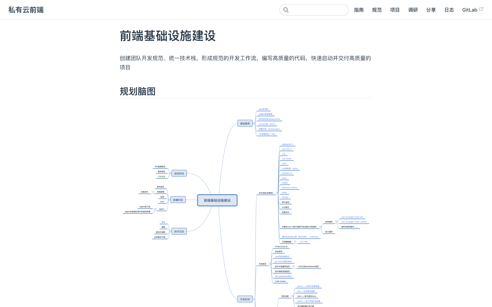
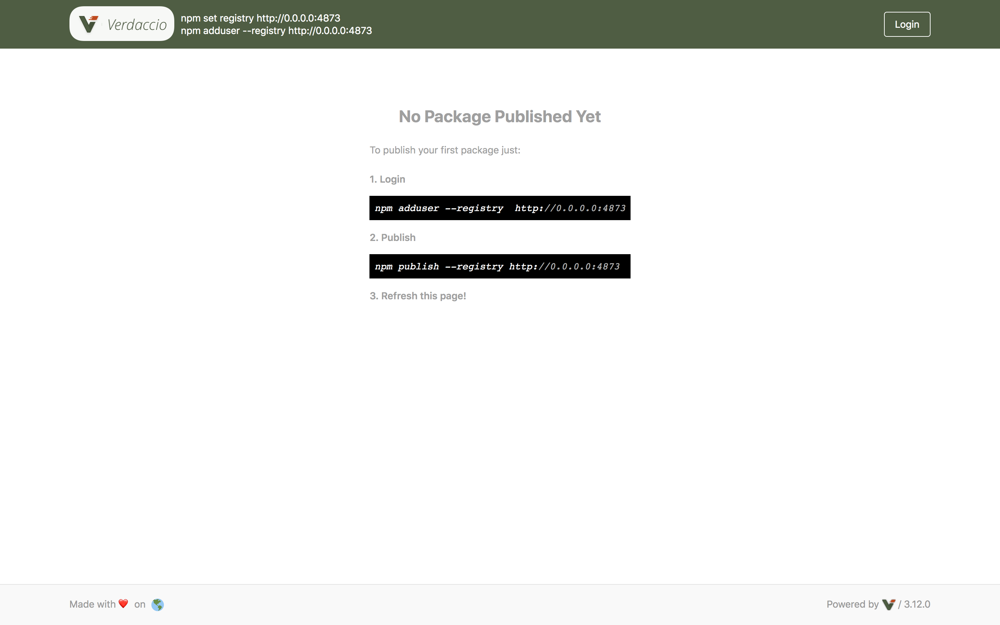

### 私有云前端基础研发体系建设

私有云部李海涛

[@haitaodesign](https://github.com/haitaodesign)

---

### 为什么做这件事？

---

1. 新的团队
2. 扩展团队的新项目研发能力
3. 不断支撑更多的业务发展
4. 通用问题解决方案的总结

---

### 整体规划

---

社区 + 个性化 = 前端基础研发体系

---

---

### 基础服务

---

#### 1. 前端基建开发文档

[VuePress](https://vuepress.vuejs.org/)

---

---

---

####  2. 开发环境搭建

从本地开发环境到基于Docker的开发环境的搭建

---

1. nvm or nvs
2. nrm
3. Git/SVN
4. Nginx
5. Docker
6. Vue CLI
7. VuePress

---

#### 3. npm 私有库

[Verdaccio](https://verdaccio.org/)

`npm install --global verdaccio`

---

---

#### 4. API管理平台

[YApi](http://yapi.private-cloud.7moor.com/)

1. 项目管理
2. 接口管理
3. MockServer

---

---

### 开发阶段

--- 

#### 1. 开发规范

---

---

1. Git commit 风格规范
2. Vue 代码风格规范
3. 语义化版本发布规范
4. 技术预研流程规范

---

### 2. 项目模板架构

---

---

---

### 3. 开发部署流程

---

---

---

#### 4. moor-ui 组件库方案

---

---

### 未来的规划

---

1. 完善开发规范，优化开发工作流
2. 改进基础模板架构
3. 业务公共组件库开发（单元测试）
4. 脚手架项目完善
5. 更多的同事参与共建

---

### 总结

---

1. 统一化，规范化
2. 可维护性
3. 开发效率
4. 明确解决的某类问题
5. 落地更多的项目

---

## 致谢 and 提问

---